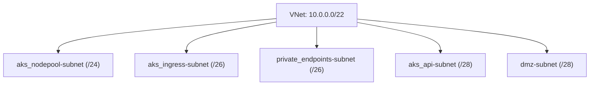

# AKS Landing Zone Network Monitoring Module


## Introduction

This module provides a private networking solution for Azure Kubernetes Service (AKS) landing zones, ready to be used in conjunction with cloudflare. It creates and manages the essential network infrastructure components required for a secure and well-organized AKS environment. The module handles the creation of Virtual Networks, subnets, Network Security Groups (NSGs), and integrates with GitHub Actions runners, providing a robust foundation for your AKS deployment.

## Example use

```hcl
module "network" {
  source = "github.com/monsieurdahlstrom/tf-azure-lz-network"

  # Required variables
  resource_group_name = "rg-lz-development"
  location           = "swedencentral"
  environment        = "development"
  project_name       = "landingzone"

  # Optional variables with defaults
  vnet_cidr = "10.0.0.0/22"  # any private /22 range
  tags = {
    Environment = "Production"
    Project     = "AKS"
  }
}

# Example of using the VNet and subnet IDs
# module.network.subnets["aks_nodepool"].id
# module.network.vnet_id

```

This example shows:
1. How to create the network infrastructure using the module
2. How to reference the VNet and subnet IDs in other resources
3. How to use the module outputs for AKS configuration

The module provides the following key outputs:
- `vnet_id`: The ID of the created Virtual Network
- `subnets`: A map of subnet names to subnet objects (containing all subnet properties)
- `subnet_ids`: A map of subnet names to subnet IDs (for quick ID references)
- `nsgs`: A map of NSG names to NSG objects

Example of using the outputs:
```hcl
# Get a subnet ID
module.network.subnet_ids["aks_nodepool"]

# Get a full subnet object
module.network.subnets["aks_nodepool"]

# Get the VNet ID
module.network.vnet_id
```

## Predefined Subnets

The module provides a comprehensive set of predefined subnets that follow Azure best practices for AKS deployments. By default, only a subset of these subnets are created, but you have the flexibility to enable any of the available subnets based on your requirements.

### Available Subnets

The module defines the following subnets with carefully planned CIDR ranges:

#### Primary Subnets (/24)
- `aks_nodepool`: Main subnet for AKS node pools
- `github_runners`: For GitHub Actions runners (Note: GitHub Network Settings integration requires GitHub Enterprise)

#### Medium Subnets (/26)
- `aks_ingress`: Dedicated subnet for ingress controllers
- `private_endpoints`: For Azure Private Endpoints

#### Small Subnets (/28)
- `aks_api`: Reserved for AKS API server
- `dmz`: Demilitarized zone for external-facing resources
- `jumpbox`: For jump box access
- `management`: For management tools and services
- `dns_resolver`: For DNS resolution services

#### Medium Reserved Subnets (/27)
- `firewall`: For Azure Firewall
- `bastion`: For Azure Bastion
- `integration`: For integration services

### Default Active Subnets

By default, the module creates the following subnets:
- `aks_nodepool`
- `aks_ingress`
- `private_endpoints`
- `aks_api`
- `dmz`



### Customization Options

The module allows you to:
- Enable any of the predefined subnets beyond the default configuration
- Modify CIDR ranges for any subnet
- Add custom subnets beyond the predefined set
- Remove any of the default subnets
- Adjust subnet sizes based on your specific needs
- Configure custom subnet properties and settings

## Network Security Groups (NSGs)

The module automatically creates and configures NSGs for each subnet with appropriate security rules. These NSGs implement the principle of least privilege, allowing only necessary traffic while maintaining security. Key features include:

- Default deny all inbound traffic
- Allow outbound internet access for required services
- Specific rules for AKS node pool communication
- Controlled access to private endpoints
- Secure ingress controller configuration
- Isolated GitHub runners network access

## VNet Flow Logging

The module enables VNet Flow Logging for enhanced network monitoring and security analysis. Flow logs capture:
- Source and destination IP addresses
- Ports and protocols
- Traffic direction
- Network security group rules applied
- Packet and byte counts

These logs are sent to Azure Monitor Logs for analysis and can be used for:
- Network traffic analysis
- Security auditing
- Compliance reporting
- Troubleshooting network issues
- Performance optimization
