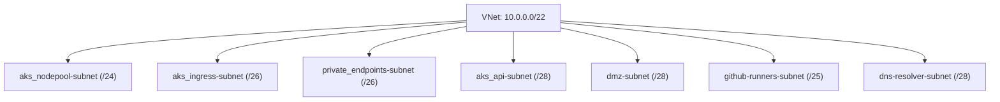

# AKS Landing Zone Network Monitoring Module

```mermaid
graph TD
  VNet["VNet: 10.0.0.0/22"]
  VNet --> A1["aks_nodepool-subnet (/24)"]
  VNet --> A2["aks_ingress-subnet (/26)"]
  VNet --> A3["private_endpoints-subnet (/26)"]
  VNet --> A4["aks_api-subnet (/28)"]
  VNet --> A5["dmz-subnet (/28)"]
  VNet --> A6["github-runners-subnet (/25)"]
  VNet --> A7["dns-resolver-subnet (/28)"]
```

This module creates subnets, NSGs, and GitHub integration with optional network settings.
